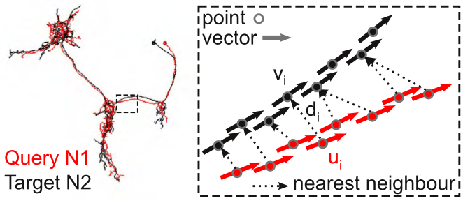
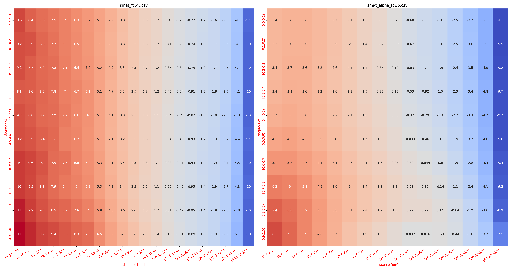
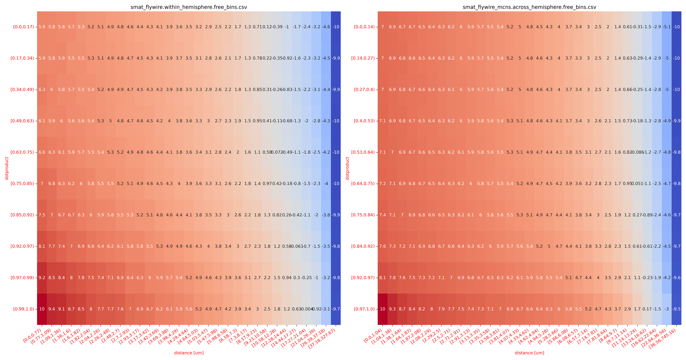

# NBLAST Scoring Matrices

## Background

NBLAST is an algorithm to quantify morphological similarity between neurons. Its second
version ([Costa et al., 2016](https://www.cell.com/neuron/fulltext/S0896-6273(16)30265-3))
uses a 2-dimensional **scoring matrix** to determine whether two points are indicative of two
neurons belonging to the same type by comparing the distance and the angle
(via their tangent vectors) between them.



The original scoring matrix was generated using neurons from the FlyCircuit project -
i.e. _Drosophila_ neurons skeletonized from light-microscopy confocal stacks co-registered
to a common template brain. Despite being created for fly neurons and from light-level data
it works surprisingly well for other types of data (e.g. EM-derived skeletons) and organisms.
That said: there may be mileage in generating specialised scoring functions for your own data.

This repository collects alternative NBLAST scoring matrices that you can plug into e.g. the
Python implementation in [`navis`](https://github.com/navis-org/navis) or the R
implementation in [`nat`](https://natverse.org/).

Contributions welcome!

## Available Scoring Matrices

### FlyCircuit (_Drosophila_)
These are the original scoring matrices from Costa _et al_. They are based on FlyCircuit light-level data of _Drosophila_ neurons that were
co-registered to a common template space.

- `scoremats/smat_fcwb.csv` is the standard v2 scoring matrix
- `scoremats/smat_alpha_fcwb.csv` is a version of the scoring matrix where the tangent vectors are additionally weighted by an `alpha` value that describes
  how well tangent vectors in the local neighborhood align and thus emphasises straight parts of the neuron (i.e. the backbones).



These matrices are already included in `navis` and `nat` and are used by default when you run NBLASTs in `navis` or `nat`.

### FlyWire / MaleCNS (_Drosophila_)
Here we used neuron reconstructions from two sources:
1. The [FlyWire connectome](https://flywire.ai/) with cell type labels from [Schlegel _et al._ (2024)](https://www.nature.com/articles/s41586-024-07686-5)
2. The Janelia/FlyEM MaleCNS connectome (manuscript in prep)

With this data we generated two scoring matrices:
- `scoremats/smat_flywire.within_hemisphere.free_bins.csv`: this scoring matrix is based entirely on the FlyWire connectome.
  There are no transforms involved and all data is from the same specimen and hemisphere which means the scoring matrix is very stringent.
- `scoremats/smat_flywire_mcns.across_hemisphere.free_bins.csv`: for this scoring matrix we combined MaleCNS with FlyWire data by
  transforming/mirroring all neurons to the right hemisphere in FlyWire space. As a result, this scoring matrix is less stringent.

Bottom line: use the first scoring matrix if you want to compare neurons from the same dataset (and hemisphere) and the second one if you need to run a
transform to get neurons into the same space (i.e. if you want to compare neurons from different datasets or hemispheres).



Some additional notes:
- the training dataset included order 30k central brain neurons per dataset and around 7k cell type labels
- neurons that tile space (such as KCs, columnar CX neurons or VPNs) were excluded
- as per convention, units are in micrometers
- the matrices were normalised to -10 to 10

## How to use custom scoring matrices

In `navis`:
```python
import navis
import pandas as pd

# Here we're using example neurons - adjust as need for your data
skels = navis.example_neurons(kind='skeleton')
dps = navis.make_dotprops(skels, k=5)

# Make sure your dotprops have the correct units (here we're converting from 8nm voxels to micrometers)
dps /= 125

# Load the scoring matrix
smat = pd.read_csv('scoremats/smat_flywire.within_hemisphere.free_bins.csv', index_col=0)

# Pass the matrix to the nblast function
scores = navis.nblast_allbyall(dps, smat=smat)
```

## How to generate your own scoring matrices

See [this tutorial](https://navis-org.github.io/navis/generated/gallery/5_nblast/tutorial_nblast_03_smat/)
on how to generate your own scoring matrices using `navis`.

## Changelog
- `21/07/2025`: added FlyWire- and MaleCNS-based scoring matrices
